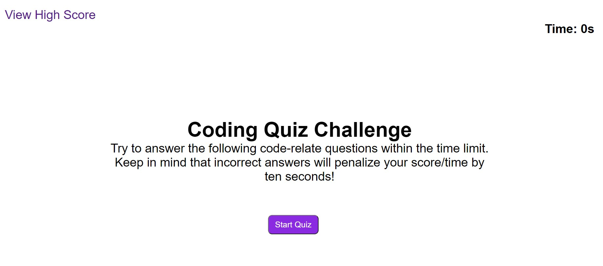
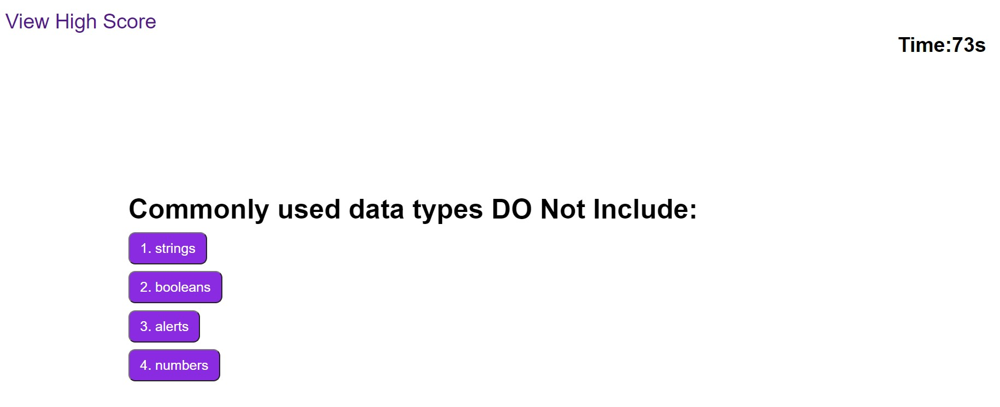
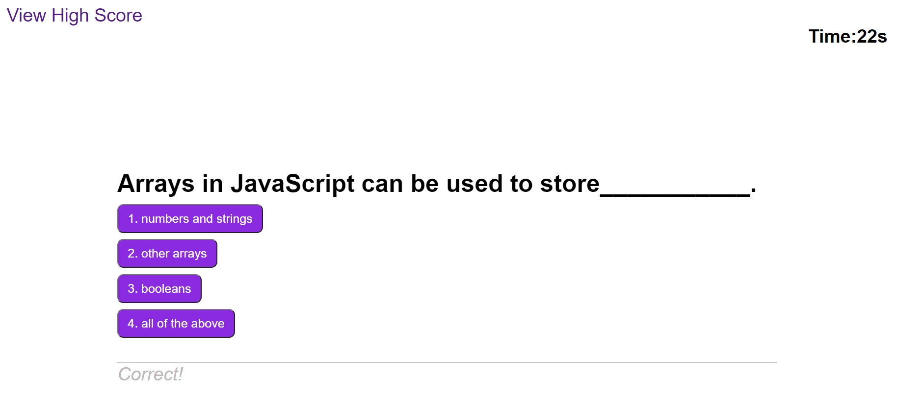

# Code-Quiz

## Descritption
- This code-quiz is time based and upon starting the quiz the timer count down starts.

- After answering each question another question is presented. 
- Wrong asnwers will be penalized by 10 seconds subtruction from there time. 
- After questions are finished then the page for initials open and the user can enter their intials and save it. 

- The highscore page will show the score from different users which is saved in the local storage. 

## The URL of the functional, deployed application

https://ghulamzaka.github.io/Code-Quiz/

## The URL of the GitHub repository

https://github.com/GhulamZaka/Code-Quiz

## ScreenShots

